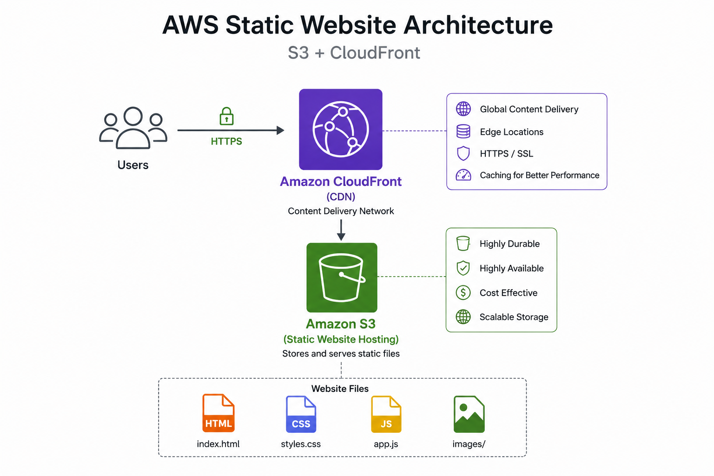
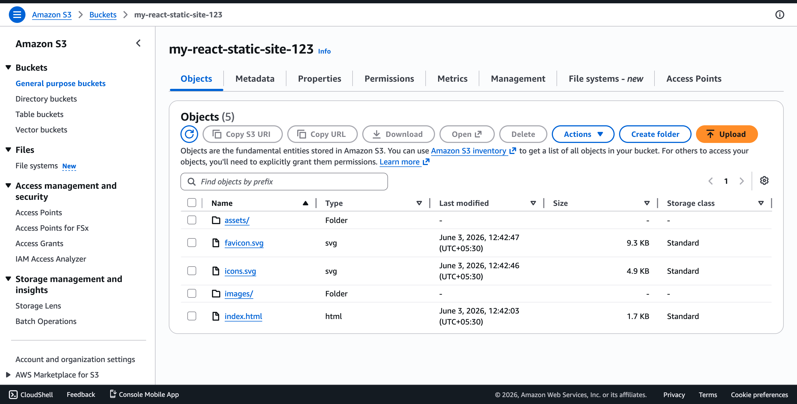
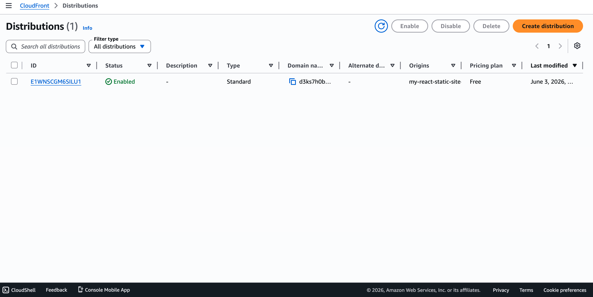

# AWS Static Website Hosting Project
## Project Overview
This project demonstrates how to deploy a modern React application on AWS using Amazon S3 for static website hosting and Amazon CloudFront as a Content Delivery Network (CDN).

The application was built using React and Vite, deployed to Amazon S3, and delivered globally through CloudFront with HTTPS support.

### Architecture



*React application deployed to Amazon S3 and delivered globally through CloudFront.*

## AWS Services Used

- Amazon S3
- CloudFront

## Project Screenshots
### Amazon S3 Bucket



**Purpose:**
- Stores the static website files (HTML, CSS, JavaScript, images).
- Provides a highly durable and scalable storage solution for static website hosting.

### Amazon CloudFront Distribution



**Purpose:**
- Delivers website content globally through AWS edge locations, reducing latency.
- Provides HTTPS support and caching to improve website performance and security.

### Live Website


**Result:**
- Successfully deployed and accessed the React application through CloudFront.
- Verified static website hosting, HTTPS connectivity, and global content delivery.

## Project Structure
```
AWS-Static-Website-Hosting/
│
├── architecture/
│   └── architecture-diagram.png
│
├── screenshots/
│   ├── website-homepage.png
│   ├── s3-bucket.png
│   └── cloudfront-distribution.png
│
├── public/
│
├── src/
│   ├── assets/
│   ├── components/
│   ├── App.jsx
│   └── main.jsx
│
├── .gitignore
├── package.json
├── vite.config.js
└── README.md
```
## Deployment Steps

1. Developed a React application using Vite.
2. Built the production-ready application using:

```bash
npm run build
```

3. Created an Amazon S3 bucket.
4. Enabled Static Website Hosting on the S3 bucket.
5. Uploaded the contents of the `dist` folder to S3.
6. Verified website accessibility through the S3 website endpoint.
7. Created a CloudFront distribution with the S3 website endpoint as the origin.
8. Configured HTTPS and caching through CloudFront.
9. Tested the application using the CloudFront domain URL.
10. Validated successful deployment and content delivery.

## Cleanup Steps

To avoid unnecessary AWS charges after testing the project, perform the following cleanup actions:

1. Disable and delete the CloudFront distribution.
2. Delete all files from the Amazon S3 bucket.
3. Delete the Amazon S3 bucket.
4. Remove any additional resources created during deployment.
5. Verify that no active AWS resources remain associated with the project.

> Note: CloudFront distributions must be disabled before they can be deleted. Deletion may take several minutes to complete.
## Conclusion

This project demonstrates how to deploy a modern React application using AWS cloud services. By leveraging Amazon S3 for static website hosting and Amazon CloudFront for content delivery, the solution provides a scalable, highly available, and cost-effective architecture.
